# PlantUML Language Reference — Полное руководство

Этот документ содержит полную спецификацию языка PlantUML для реализации в plantuml-rs.

---

## Оглавление

1. [Общая структура](#1-общая-структура)
2. [Sequence Diagram](#2-sequence-diagram)
3. [Class Diagram](#3-class-diagram)
4. [Activity Diagram](#4-activity-diagram)
5. [State Diagram](#5-state-diagram)
6. [Use Case Diagram](#6-use-case-diagram)
7. [Component Diagram](#7-component-diagram)
8. [Deployment Diagram](#8-deployment-diagram)
9. [Object Diagram](#9-object-diagram)
10. [Timing Diagram](#10-timing-diagram)
11. [Skinparam](#11-skinparam)
12. [Препроцессор](#12-препроцессор)
13. [Creole и форматирование](#13-creole-и-форматирование)
14. [Цвета](#14-цвета)
15. [Темы](#15-темы)

---

## 1. Общая структура

### Начало и конец диаграммы

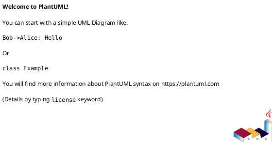

### Комментарии

```plantuml
' Однострочный комментарий

/' Многострочный
   комментарий '/
```

### Заголовок, header, footer

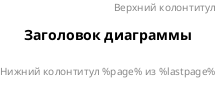

### Разбиение на страницы

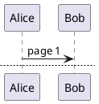

---

## 2. Sequence Diagram

### 2.1 Участники (Participants)

#### Типы участников

| Ключевое слово | Описание |
|----------------|----------|
| `participant` | Прямоугольник (по умолчанию) |
| `actor` | Человечек (stick man) |
| `boundary` | Граница системы |
| `control` | Контроллер (круг) |
| `entity` | Сущность (подчёркнутый) |
| `database` | База данных (цилиндр) |
| `collections` | Коллекции |
| `queue` | Очередь |

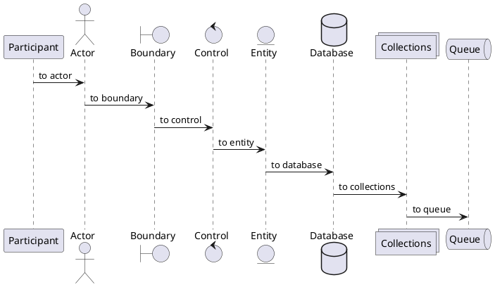

#### Порядок участников

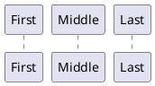

#### Алиасы и цвета

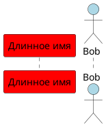

#### Стиль актора

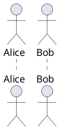

### 2.2 Сообщения (Messages)

#### Типы стрелок

| Синтаксис | Описание |
|-----------|----------|
| `->` | Сплошная линия, закрытая стрелка |
| `-->` | Пунктирная линия, закрытая стрелка |
| `->>` | Сплошная линия, тонкая стрелка |
| `-->>` | Пунктирная линия, тонкая стрелка |
| `-\` | Сплошная, верхняя половина стрелки |
| `-/` | Сплошная, нижняя половина стрелки |
| `->x` | Потерянное сообщение (крест) |
| `<->` | Двунаправленная стрелка |
| `->>o` | Стрелка с кружком |
| `o->o` | Кружки с обеих сторон |

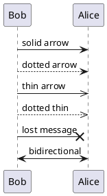

#### Цвет стрелки

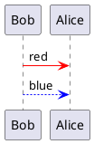

#### Self-message (сообщение себе)

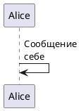

#### Входящие и исходящие сообщения

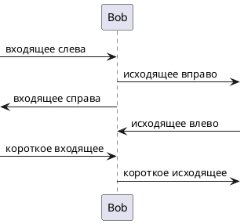

### 2.3 Выравнивание текста сообщений

```plantuml
@startuml
skinparam sequenceMessageAlign left   ' left (по умолчанию), center, right
skinparam sequenceMessageAlign center
skinparam sequenceMessageAlign right
skinparam sequenceMessageAlign direction      ' зависит от направления стрелки
skinparam sequenceMessageAlign reverseDirection
@enduml
```

### 2.4 Нумерация сообщений

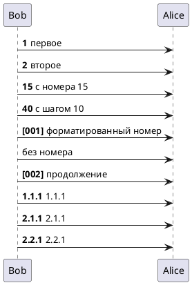

### 2.5 Lifeline (линия жизни)

#### Активация/деактивация

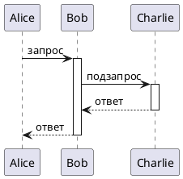

#### Цвет активации

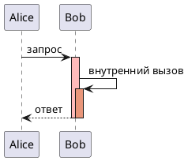

#### Короткий синтаксис

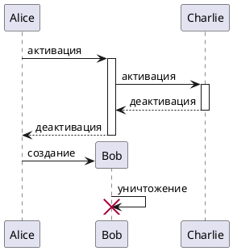

#### Destroy

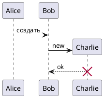

### 2.6 Return

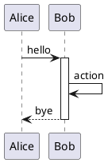

### 2.7 Фрагменты (Combined Fragments)

#### Типы фрагментов

| Ключевое слово | Описание |
|----------------|----------|
| `alt` / `else` | Альтернатива (if-else) |
| `opt` | Опциональный |
| `loop` | Цикл |
| `par` | Параллельный |
| `break` | Прерывание |
| `critical` | Критическая секция |
| `group` | Произвольная группа |

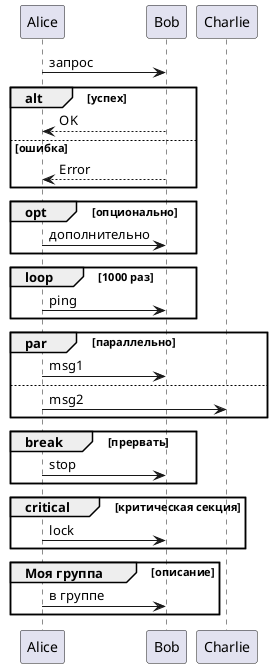

#### Цвета фрагментов

```plantuml
@startuml
Alice -> Bob : запрос
alt#Gold #LightBlue успех
    Bob --> Alice : OK
else #Pink ошибка
    Bob --> Alice : Error
end
@enduml
```

### 2.8 Заметки (Notes)

```plantuml
@startuml
Alice -> Bob : hello
note left: заметка слева
note right: заметка справа

note left of Alice: заметка слева от Alice
note right of Bob: заметка справа от Bob
note over Alice: над Alice
note over Alice, Bob: над обоими

note over Alice
  Многострочная
  заметка
end note

' Формы заметок
hnote over Alice : шестиугольная
rnote over Bob : прямоугольная

' Заметка на всех участниках
note across: на всю ширину
@enduml
```

#### Выровненные заметки

```plantuml
@startuml
note over Alice : первая
/ note over Bob : вторая (выровнена)
@enduml
```

### 2.9 Разделители

```plantuml
@startuml
== Инициализация ==
Alice -> Bob : init
== Основная логика ==
Alice -> Bob : process
== Завершение ==
Alice -> Bob : finish
@enduml
```

### 2.10 Reference

```plantuml
@startuml
participant Alice
actor Bob

ref over Alice, Bob : init

Alice -> Bob : hello

ref over Bob
  Многострочная
  ссылка
end ref
@enduml
```

### 2.11 Delay

```plantuml
@startuml
Alice -> Bob : запрос
...
Bob --> Alice : ответ
...5 минут позже...
Bob --> Alice : уточнение
@enduml
```

### 2.12 Spacing

```plantuml
@startuml
Alice -> Bob : msg1
|||
Alice -> Bob : msg2 (после отступа)
||45||
Alice -> Bob : msg3 (после 45px)
@enduml
```

### 2.13 Box (группировка участников)

```plantuml
@startuml
box "Internal" #LightBlue
    participant Bob
    participant Alice
end box
participant Other

Bob -> Alice : внутри
Alice -> Other : наружу
@enduml
```

#### Вложенные box (teoz)

```plantuml
@startuml
!pragma teoz true
box "Outer" #LightBlue
    participant Bob
    box "Inner"
        participant Alice
        participant John
    end box
end box
@enduml
```

### 2.14 Footbox

```plantuml
@startuml
hide footbox   ' скрыть нижние прямоугольники участников
Alice -> Bob : hello
@enduml
```

### 2.15 Mainframe

```plantuml
@startuml
mainframe sd Sequence
Alice -> Bob : hello
@enduml
```

### 2.16 Stereotypes

```plantuml
@startuml
participant "Bob" as Bob << Generated >>
participant Alice << (C,#ADD1B2) Testable >>

Bob -> Alice : hello
@enduml
```

### 2.17 Teoz Engine

```plantuml
@startuml
!pragma teoz true

{start} Alice -> Bob : начало
Bob -> Max : что-то
Max -> Bob : ответ
{end} Bob -> Alice : конец

{start} <-> {end} : время выполнения
@enduml
```

### 2.18 Slanted/Odd Arrows

```plantuml
@startuml
A ->(10) B: слегка смещённая
B ->(30) A: более смещённая

!pragma teoz true
A ->(50) C: с teoz &
B ->(25) C: параллельная
@enduml
```

---

## 3. Class Diagram

### 3.1 Объявление элементов

```plantuml
@startuml
abstract        AbstractClass
abstract class  "Abstract Class" as AC
annotation      Annotation
circle          Circle
()              CircleShort
class           MyClass
class           MyClass2 <<stereotype>>
diamond         Diamond
<>              DiamondShort
entity          Entity
enum            MyEnum
exception       MyException
interface       MyInterface
metaclass       MetaClass
protocol        Protocol
struct          Struct
@enduml
```

### 3.2 Отношения между классами

| Символ | Тип | Описание |
|--------|-----|----------|
| `<\|--` | Extension | Наследование |
| `<\|..` | Implementation | Реализация интерфейса |
| `*--` | Composition | Композиция (часть не может существовать отдельно) |
| `o--` | Aggregation | Агрегация (часть может существовать отдельно) |
| `-->` | Dependency | Зависимость |
| `..>` | Dependency | Слабая зависимость |
| `--` | Association | Ассоциация |
| `..` | | Пунктирная линия |

```plantuml
@startuml
Class01 <|-- Class02 : наследование
Class03 *-- Class04 : композиция
Class05 o-- Class06 : агрегация
Class07 --> Class08 : зависимость
Class09 -- Class10 : ассоциация
Class11 <.. Class12 : пунктирная зависимость
Class13 ..|> Interface14 : реализация
@enduml
```

### 3.3 Метки и кардинальность

```plantuml
@startuml
Class01 "1" *-- "many" Class02 : contains
Class03 o-- Class04 : aggregation
Class05 --> "1" Class06
@enduml
```

### 3.4 Поля и методы

```plantuml
@startuml
class Dummy {
    - privateField : String
    # protectedField : int
    ~ packageField : double
    + publicField : boolean
    
    - privateMethod()
    # protectedMethod()
    ~ packageMethod()
    + publicMethod()
    
    {static} staticField : String
    {abstract} abstractMethod()
}
@enduml
```

#### Разделители в теле класса

```plantuml
@startuml
class User {
    .. Getters ..
    + getName()
    + getAddress()
    == Setters ==
    + setName()
    -- Private --
    - int age
    __ Encrypted __
    - String password
}
@enduml
```

### 3.5 Generics

```plantuml
@startuml
class Foo<T extends Element> {
    int size()
}
Foo *- Element
@enduml
```

### 3.6 Packages

```plantuml
@startuml
package "Domain" {
    class User
    class Order
}

package "Infrastructure" <<Database>> {
    class UserRepository
}

' Стили пакетов: Node, Rectangle, Folder, Frame, Cloud, Database
package foo1 <<Node>> { class Class1 }
package foo2 <<Rectangle>> { class Class2 }
package foo3 <<Folder>> { class Class3 }
package foo4 <<Frame>> { class Class4 }
package foo5 <<Cloud>> { class Class5 }
package foo6 <<Database>> { class Class6 }
@enduml
```

### 3.7 Namespaces

```plantuml
@startuml
class A.B.C.D.Z { }

' Или отключить автосоздание пакетов
set separator none
class A.B.C.D.Z { }
@enduml
```

### 3.8 Notes

```plantuml
@startuml
class Object << general >>
Object <|-- ArrayList

note top of Object : В Java все классы наследуют от Object

note "Плавающая заметка" as N1
note "Связана с несколькими" as N2
Object .. N2
N2 .. ArrayList

class Foo
note left: на последнем определённом классе

' Заметка на поле или методе
class A {
    {static} int counter
    +void start(int timeout)
}
note right of A::counter
    Заметка на поле
end note
note right of A::start
    Заметка на методе
end note

' Заметка на связи
Dummy --> Foo : связь
note on link #red: заметка на связи
@enduml
```

### 3.9 Hide/Show/Remove

```plantuml
@startuml
class Dummy1 { +myMethods() }
class Dummy2 { +hiddenMethod() }
class Dummy3 <<Serializable>> { String name }

hide members                    ' скрыть все члены
hide <<Serializable>> circle    ' скрыть круг у стереотипа
show Dummy1 methods             ' показать методы Dummy1
show <<Serializable>> fields    ' показать поля Serializable

' Скрыть/удалить классы
hide Foo2
remove Foo3
hide @unlinked                  ' скрыть несвязанные классы
@enduml
```

### 3.10 Направление стрелок

```plantuml
@startuml
foo -left-> dummyLeft
foo -right-> dummyRight
foo -up-> dummyUp
foo -down-> dummyDown

' Можно сокращать: -l->, -r->, -u->, -d->
@enduml
```

### 3.11 Together

```plantuml
@startuml
together {
    class Together1
    class Together2
}
class Alone
@enduml
```

### 3.12 Группировка наследования

```plantuml
@startuml
skinparam groupInheritance 3  ' группировать от 3 наследников

A1 <|-- B1
A2 <|-- B2
A2 <|-- C2
A3 <|-- B3
A3 <|-- C3
A3 <|-- D3
@enduml
```

### 3.13 Стили inline

```plantuml
@startuml
class Foo #red-green ##[bold]blue
class Bar #line:green;line.dashed;text:red
@enduml
```

---

## 4. Activity Diagram (Новый синтаксис)

### 4.1 Простые действия

```plantuml
@startuml
:Hello world;
:Это многострочное
действие;
@enduml
```

### 4.2 Start/Stop/End

```plantuml
@startuml
start
:действие 1;
:действие 2;
stop

' или end вместо stop
@enduml
```

### 4.3 Условия (if/then/else)

```plantuml
@startuml
start
if (условие?) then (да)
    :действие A;
else (нет)
    :действие B;
endif
stop
@enduml
```

#### Несколько условий

```plantuml
@startuml
start
if (A?) then (yes)
    :Text 1;
elseif (B?) then (yes)
    :Text 2;
elseif (C?) then (yes)
    :Text 3;
else (nothing)
    :Text else;
endif
stop
@enduml
```

### 4.4 Switch/Case

```plantuml
@startuml
start
switch (test?)
case (A)
    :Text 1;
case (B)
    :Text 2;
case (C)
    :Text 3;
endswitch
stop
@enduml
```

### 4.5 Циклы

#### Repeat

```plantuml
@startuml
start
repeat
    :read data;
    :process;
repeat while (more data?) is (yes) not (no)
stop
@enduml
```

#### While

```plantuml
@startuml
start
while (data available?)
    :read data;
endwhile
stop
@enduml
```

### 4.6 Parallel (Fork)

```plantuml
@startuml
start
fork
    :action 1;
fork again
    :action 2;
end fork
stop

' Или end merge вместо end fork
@enduml
```

### 4.7 Split

```plantuml
@startuml
start
split
    :A;
split again
    :B;
split again
    :C;
end split
:D;
end
@enduml
```

### 4.8 Notes

```plantuml
@startuml
start
:foo1;
floating note left: плавающая заметка
:foo2;
note right
  Многострочная
  заметка
end note
stop
@enduml
```

### 4.9 Colors

```plantuml
@startuml
start
#HotPink:действие с цветом;
#AAAAAA:серое действие;
stop
@enduml
```

### 4.10 Arrows

```plantuml
@startuml
:foo1;
-> текст на стрелке;
if (test) then
    -[#blue]->
    :foo2;
    -[#green,dashed]-> длинный текст;
    :foo3;
else
    -[#black,dotted]->
    :foo4;
endif
@enduml
```

### 4.11 Connectors

```plantuml
@startuml
start
:action;
(A)
detach
(A)
:continue;
@enduml
```

### 4.12 Partition/Group

```plantuml
@startuml
start
partition Initialization {
    :read config;
    :init variables;
}
partition Running {
    :main process;
}
stop
@enduml
```

### 4.13 Swimlanes

```plantuml
@startuml
|Swimlane1|
start
:action1;
|#AntiqueWhite|Swimlane2|
:action2;
|Swimlane1|
:action3;
stop
@enduml
```

### 4.14 SDL Shapes

```plantuml
@startuml
start
:input; <<input>>
:output; <<output>>
:procedure; <<procedure>>
:task; <<task>>
end
@enduml
```

### 4.15 Kill/Detach

```plantuml
@startuml
start
if (error?) then
    :error;
    kill
endif
:continue;
stop
@enduml
```

---

## 5. State Diagram

### 5.1 Простые состояния

```plantuml
@startuml
[*] --> State1
State1 --> [*]
State1 : описание
State1 : ещё описание
State1 -> State2
State2 --> [*]
@enduml
```

### 5.2 Композитные состояния

```plantuml
@startuml
[*] --> Active

state Active {
    [*] --> Idle
    Idle --> Running : start
    Running --> Idle : stop
}
@enduml
```

### 5.3 Длинные имена

```plantuml
@startuml
state "Длинное имя состояния" as long1
long1 : описание
[*] --> long1
@enduml
```

### 5.4 History

```plantuml
@startuml
state S {
    [*] -> S1
    S1 --> S2
}
[*] --> S
S --> [H] : shallow history
S --> [H*] : deep history
@enduml
```

### 5.5 Fork/Join

```plantuml
@startuml
state fork_state <<fork>>
[*] --> fork_state
fork_state --> State2
fork_state --> State3

state join_state <<join>>
State2 --> join_state
State3 --> join_state
join_state --> [*]
@enduml
```

### 5.6 Concurrent States

```plantuml
@startuml
[*] --> Active

state Active {
    [*] -> NumLockOff
    NumLockOff --> NumLockOn : press
    NumLockOn --> NumLockOff : press
    --
    [*] -> CapsLockOff
    CapsLockOff --> CapsLockOn : press
    CapsLockOn --> CapsLockOff : press
}
@enduml
```

### 5.7 Choice

```plantuml
@startuml
state c <<choice>>
[*] --> c
c --> Minor : [id <= 10]
c --> Major : [id > 10]
@enduml
```

### 5.8 Entry/Exit Points

```plantuml
@startuml
state Somp {
    state entry1 <<entryPoint>>
    state exit1 <<exitPoint>>
    entry1 --> inner
    inner --> exit1
}
[*] --> entry1
exit1 --> [*]
@enduml
```

### 5.9 Notes

```plantuml
@startuml
[*] --> Active
Active --> Inactive

note left of Active : заметка слева
note right of Inactive
    Многострочная
    заметка
end note
@enduml
```

---

## 6. Use Case Diagram

### 6.1 Use Cases

```plantuml
@startuml
(First usecase)
(Another usecase) as (UC2)
usecase UC3
usecase (Last\nusecase) as UC4
@enduml
```

### 6.2 Actors

```plantuml
@startuml
:First Actor:
:Another\nactor: as Man2
actor Woman3
actor :Last actor: as Person1
@enduml
```

### 6.3 Связи

```plantuml
@startuml
User -> (Start)
User --> (Use the application) : label

:Admin: ---> (Use the application) : многострочная\nметка
@enduml
```

### 6.4 Extension

```plantuml
@startuml
:Admin: as Admin
(Use) as (Use)

User <|-- Admin
(Start) <|-- (Use)
@enduml
```

### 6.5 Packages/Rectangles

```plantuml
@startuml
left to right direction

rectangle Restaurant {
    usecase "Eat Food" as UC1
    usecase "Pay" as UC2
}

actor Guest
Guest --> UC1
Guest --> UC2
@enduml
```

### 6.6 Business Use Case

```plantuml
@startuml
(Business usecase)/
actor/ BusinessActor
@enduml
```

---

## 7. Component Diagram

```plantuml
@startuml
package "Frontend" {
    [Web App]
    [Mobile App]
}

package "Backend" {
    [API Gateway]
    [User Service]
}

database "PostgreSQL"

[Web App] --> [API Gateway]
[API Gateway] --> [User Service]
[User Service] --> [PostgreSQL]
@enduml
```

---

## 8. Deployment Diagram

```plantuml
@startuml
node "Web Server" {
    [Apache]
}

node "App Server" {
    [Tomcat]
}

database "MySQL"

[Apache] --> [Tomcat]
[Tomcat] --> [MySQL]
@enduml
```

---

## 9. Object Diagram

```plantuml
@startuml
object user1 {
    name = "John"
    age = 30
}

object user2 {
    name = "Jane"
    age = 25
}

user1 --> user2 : friend
@enduml
```

---

## 10. Timing Diagram

```plantuml
@startuml
robust "Web Browser" as WB
concise "Server" as S

@0
WB is Idle
S is Idle

@100
WB is Running
S is Processing

@300
WB is Idle
S is Idle
@enduml
```

---

## 11. Skinparam

### 11.1 Основные параметры

```plantuml
@startuml
skinparam backgroundColor #EEEEEE
skinparam handwritten true
skinparam shadowing false
skinparam monochrome true
skinparam monochrome reverse
@enduml
```

### 11.2 Sequence Diagram

```plantuml
@startuml
skinparam sequenceMessageAlign left  ' left (default), center, right, direction
skinparam responseMessageBelowArrow true
skinparam sequenceArrowThickness 2
skinparam roundcorner 20
skinparam maxmessagesize 60
skinparam lifelineStrategy solid    ' или nosolid (default)
skinparam style strictuml           ' UML-совместимые стрелки

skinparam sequence {
    ArrowColor DeepSkyBlue
    ActorBorderColor DeepSkyBlue
    LifeLineBorderColor blue
    LifeLineBackgroundColor #A9DCDF
    ParticipantBorderColor DeepSkyBlue
    ParticipantBackgroundColor DodgerBlue
    ParticipantFontName Impact
    ParticipantFontSize 17
    ParticipantFontColor #A9DCDF
    ActorBackgroundColor aqua
    ActorFontColor DeepSkyBlue
    ActorFontSize 17
    ActorFontName Arial
}
@enduml
```

### 11.3 Class Diagram

```plantuml
@startuml
skinparam class {
    BackgroundColor PaleGreen
    ArrowColor SeaGreen
    BorderColor SpringGreen
}
skinparam classAttributeIconSize 0
skinparam groupInheritance 3
@enduml
```

### 11.4 Paddings

```plantuml
@startuml
skinparam ParticipantPadding 20
skinparam BoxPadding 10
@enduml
```

### 11.5 Шрифты

```plantuml
@startuml
skinparam defaultFontName Arial
skinparam classFontColor red
skinparam classFontSize 10
skinparam classFontName Courier
@enduml
```

---

## 12. Препроцессор

### 12.1 Переменные

```plantuml
@startuml
!$name = "Alice"
!$color = "#FF0000"

participant $name #$color
@enduml
```

### 12.2 Условия

```plantuml
@startuml
!$debug = %true()

!if $debug
    note: Debug mode
!endif

!ifdef VARIABLE
    ' если определена
!endif

!ifndef VARIABLE
    ' если не определена
!endif
@enduml
```

### 12.3 Include

```plantuml
@startuml
!include common.puml
!include_once styles.puml
!include <stdlib/aws>
!include https://example.com/common.puml
@enduml
```

### 12.4 Функции

```plantuml
@startuml
!function $double($x)
    !return $x * 2
!endfunction

!$result = $double(5)
@enduml
```

### 12.5 Процедуры

```plantuml
@startuml
!procedure $myproc($arg)
    participant $arg
!endprocedure

$myproc(Alice)
$myproc(Bob)
@enduml
```

### 12.6 Builtin функции

| Функция | Описание |
|---------|----------|
| `%date()` | Текущая дата |
| `%time()` | Текущее время |
| `%version()` | Версия PlantUML |
| `%filename()` | Имя файла |
| `%dirpath()` | Путь к директории |
| `%true()` | Логическое true |
| `%false()` | Логическое false |
| `%not($x)` | Логическое NOT |
| `%strlen($s)` | Длина строки |
| `%substr($s, $start, $len)` | Подстрока |
| `%upper($s)` | В верхний регистр |
| `%lower($s)` | В нижний регистр |
| `%newline()` | Перенос строки |
| `%string($x)` | Преобразование в строку |
| `%intval($s)` | Преобразование в число |
| `%autonumber%` | Текущий номер сообщения |
| `%page%` | Текущая страница |
| `%lastpage%` | Последняя страница |

### 12.7 Pragma

```plantuml
@startuml
!pragma teoz true
!pragma layout smetana
!pragma useVerticalIf on
@enduml
```

---

## 13. Creole и форматирование

### 13.1 Текстовое форматирование

| Синтаксис | Результат |
|-----------|-----------|
| `**bold**` | **жирный** |
| `//italic//` | *курсив* |
| `""monospaced""` | `моноширинный` |
| `--striked--` | ~~зачёркнутый~~ |
| `__underlined__` | подчёркнутый |
| `~~waved~~` | волнистый |

### 13.2 HTML теги

```plantuml
@startuml
note as N
  <b>bold</b>
  <i>italic</i>
  <u>underlined</u>
  <s>striked</s>
  <font color="red">colored</font>
  <color:blue>also colored</color>
  <size:18>larger</size>
  <back:yellow>background</back>
end note
@enduml
```

### 13.3 Списки

```plantuml
@startuml
note as N
  * Item 1
  * Item 2
    ** Nested
  # Numbered 1
  # Numbered 2
end note
@enduml
```

### 13.4 Таблицы

```plantuml
@startuml
note as N
  |= Column 1 |= Column 2 |
  | Cell 1 | Cell 2 |
  | Cell 3 | Cell 4 |
end note
@enduml
```

---

## 14. Цвета

### 14.1 Именованные цвета

PlantUML поддерживает все стандартные HTML цвета: `red`, `blue`, `green`, `yellow`, `orange`, `purple`, `pink`, `black`, `white`, `gray`, `transparent`, и т.д.

### 14.2 RGB

```plantuml
#RGB       ' например #F00 (красный)
#RRGGBB    ' например #FF0000 (красный)
#RRGGBBAA  ' с альфа-каналом
```

### 14.3 Градиенты

```plantuml
#color1|color2     ' вертикальный
#color1/color2     ' диагональный /
#color1\color2     ' диагональный \
#color1-color2     ' горизонтальный
```

---

## 15. Темы

```plantuml
@startuml
!theme cerulean
!theme spacelab from https://...
@enduml
```

### Встроенные темы

- `cerulean`
- `spacelab`
- `sketchy-outline`
- `materia`
- `plain`
- И другие

---

## Приложение: Таблица приоритетов реализации

| Функциональность | Приоритет | Статус |
|-----------------|-----------|--------|
| Sequence Diagram - базовые сообщения | Высокий | ✅ |
| Sequence Diagram - participants | Высокий | ✅ |
| Sequence Diagram - lifelines | Высокий | ✅ |
| Sequence Diagram - fragments | Высокий | ✅ |
| Sequence Diagram - notes | Средний | ⏳ |
| Class Diagram - классы | Высокий | ✅ |
| Class Diagram - отношения | Высокий | ✅ |
| Activity Diagram | Средний | ⏳ |
| State Diagram | Средний | ⏳ |
| Use Case Diagram | Средний | ⏳ |
| Component Diagram | Низкий | ⏳ |
| Skinparam | Средний | Частично |
| Препроцессор | Средний | Частично |
| Темы | Низкий | ⏳ |

---

## Ссылки

- [PlantUML Official](https://plantuml.com/)
- [PlantUML Language Reference Guide (PDF)](https://plantuml.com/guide)
- [PlantUML Online Server](https://www.plantuml.com/plantuml/uml/)
- [PlantUML Forum](https://forum.plantuml.net/)
