# Синтаксис PlantUML — Справочник

Этот документ описывает синтаксис PlantUML, который должен поддерживаться библиотекой plantuml-rs.

---

## Общая структура

Каждая диаграмма начинается с `@startuml` и заканчивается `@enduml`:

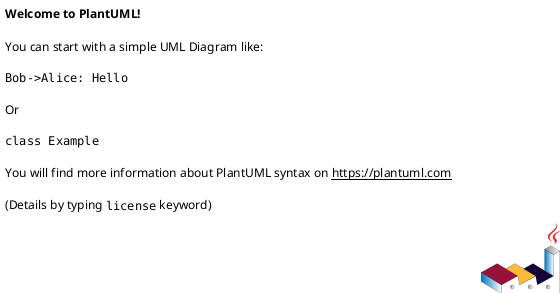

### Комментарии

```plantuml
' Однострочный комментарий

/' Многострочный
   комментарий '/
```

---

## 1. Sequence Diagram

### Участники

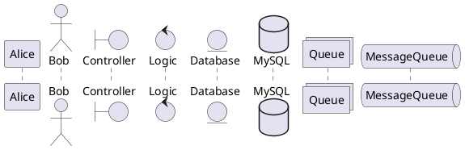

### Сообщения

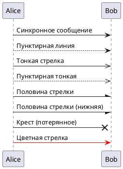

### Self-сообщения

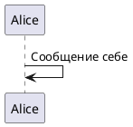

### Активации

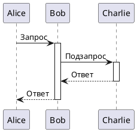

Короткая форма:


### Фрагменты

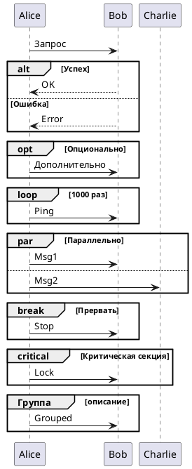

### Заметки

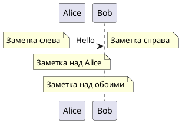

### Разделители

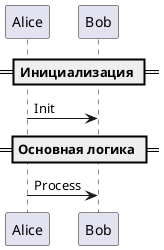

---

## 2. Class Diagram

### Классы

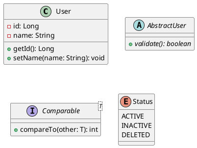

### Модификаторы видимости

- `-` private
- `#` protected
- `~` package private
- `+` public

### Статические и абстрактные члены

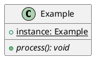

### Отношения

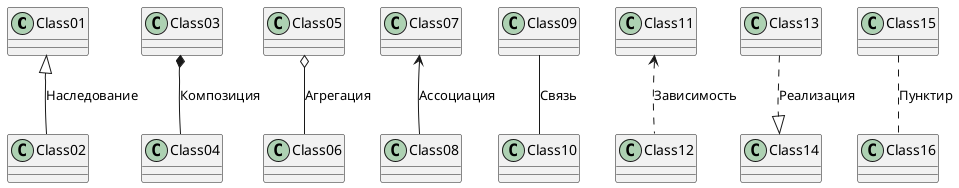

### Множественность

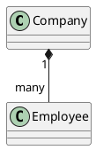

### Пакеты

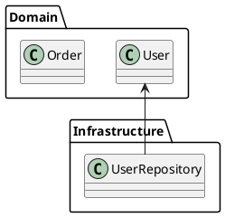

---

## 3. Activity Diagram (новый синтаксис)

### Основные элементы

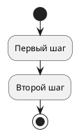

### Условия

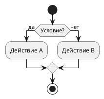

### Циклы

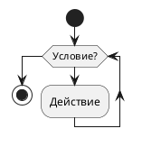

### Параллельные ветки

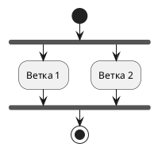

### Swim lanes

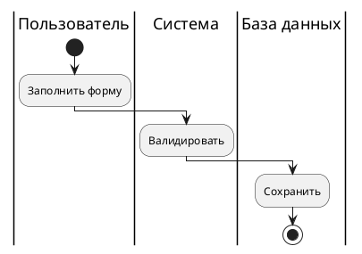

---

## 4. State Diagram

### Состояния

```plantuml
@startuml
[*] --> State1
State1 --> State2 : Событие
State2 --> [*]
@enduml
```

### Вложенные состояния

```plantuml
@startuml
state Active {
    [*] --> SubState1
    SubState1 --> SubState2
    SubState2 --> [*]
}

[*] --> Active
Active --> [*]
@enduml
```

### Параллельные состояния

```plantuml
@startuml
state Parallel {
    state A {
        [*] --> A1
    }
    --
    state B {
        [*] --> B1
    }
}
@enduml
```

---

## 5. Component Diagram

```plantuml
@startuml
package "Frontend" {
    [Web App]
    [Mobile App]
}

package "Backend" {
    [API Gateway]
    [User Service]
    [Order Service]
}

database "PostgreSQL" {
}

[Web App] --> [API Gateway]
[Mobile App] --> [API Gateway]
[API Gateway] --> [User Service]
[API Gateway] --> [Order Service]
[User Service] --> [PostgreSQL]
[Order Service] --> [PostgreSQL]
@enduml
```

---

## 6. Use Case Diagram

```plantuml
@startuml
left to right direction

actor User
actor Admin

rectangle System {
    usecase "Войти" as UC1
    usecase "Просмотр" as UC2
    usecase "Редактировать" as UC3
}

User --> UC1
User --> UC2
Admin --> UC3
Admin --> UC1
@enduml
```

---

## 7. Препроцессор

### Переменные

```plantuml
@startuml
!$name = "Alice"
!$color = "#FF0000"

participant $name
@enduml
```

### Условия

```plantuml
@startuml
!$debug = %true()

!if $debug
    note: Debug mode
!endif
@enduml
```

### Include

```plantuml
@startuml
!include common.puml
!include_once styles.puml
!include <stdlib/aws>
@enduml
```

### Функции

```plantuml
@startuml
!function $double($x)
    !return $x * 2
!endfunction

!$result = $double(5)
@enduml
```

### Builtin функции

| Функция | Описание |
|---------|----------|
| `%date()` | Текущая дата |
| `%time()` | Текущее время |
| `%version()` | Версия PlantUML |
| `%filename()` | Имя файла |
| `%dirpath()` | Путь к директории |
| `%true()` | Логическое true |
| `%false()` | Логическое false |
| `%not($x)` | Логическое NOT |
| `%strlen($s)` | Длина строки |
| `%substr($s, $start, $len)` | Подстрока |
| `%upper($s)` | В верхний регистр |
| `%lower($s)` | В нижний регистр |

---

## 8. Skinparam

```plantuml
@startuml
skinparam backgroundColor #EEEEEE
skinparam handwritten true
skinparam sequenceArrowThickness 2
skinparam roundcorner 20
skinparam maxmessagesize 60

skinparam sequence {
    ArrowColor DeepSkyBlue
    ActorBorderColor DeepSkyBlue
    LifeLineBorderColor blue
    LifeLineBackgroundColor #A9DCDF
    
    ParticipantBorderColor DeepSkyBlue
    ParticipantBackgroundColor DodgerBlue
    ParticipantFontName Impact
    ParticipantFontSize 17
    ParticipantFontColor #A9DCDF
}

Alice -> Bob: Hello
@enduml
```

---

## 9. Темы

```plantuml
@startuml
!theme cerulean
' или
!theme spacelab from https://...
@enduml
```

Встроенные темы:
- `cerulean`
- `spacelab`
- `sketchy-outline`
- `materia`
- И другие

---

## Ссылки

- [PlantUML Language Reference](https://plantuml.com/guide)
- [PlantUML Sequence Diagram](https://plantuml.com/sequence-diagram)
- [PlantUML Class Diagram](https://plantuml.com/class-diagram)
- [PlantUML Activity Diagram](https://plantuml.com/activity-diagram-beta)
- [PlantUML State Diagram](https://plantuml.com/state-diagram)
