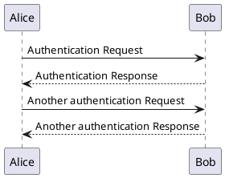

# Отчёт о визуальной сверке с оригинальным PlantUML

**Дата последнего обновления:** 2025-01-03

## Методология

Для каждого типа диаграммы:
1. Создаётся тестовый PlantUML код
2. Генерируется SVG на https://www.plantuml.com/plantuml/
3. Генерируется SVG нашим рендером
4. Сравниваются ключевые параметры

## Общие исправления (применены ко всем диаграммам)

| Параметр | Было | Стало (PlantUML style) |
|----------|------|------------------------|
| rx/ry (скругление углов) | 5.0 | 2.5 |
| stroke-width (участники) | 1.0 | 0.5 |
| stroke-width (lifelines) | 1.0 | 0.5 |
| stroke-dasharray (dashed) | 5,5 | 2,2 |
| font-size (участники) | 13 | 14 |
| font-size (сообщения) | 12 | 13 |
| Форма стрелки | треугольник | ромб с вырезом |

---

## Sequence Diagram

**Статус: ✅ Проверено и исправлено**

### Тестовый код

### Сравнение параметров

| Параметр | PlantUML | plantuml-rs | Статус |
|----------|----------|-------------|--------|
| Размеры диаграммы | 296x208 | 368x201 | ⚠️ Шире |
| rx/ry участников | 2.5 | 2.5 | ✅ |
| stroke-width участников | 0.5 | 0.5 | ✅ |
| stroke-width lifelines | 0.5 | 0.5 | ✅ |
| stroke-dasharray (dashed) | 2,2 | 2,2 | ✅ |
| stroke-dasharray (lifelines) | 5,5 | 5,5 | ✅ |
| font-size участников | 14 | 14 | ✅ |
| font-size сообщений | 13 | 13 | ✅ |
| Форма стрелки | polygon (ромб) | marker (ромб) | ✅ |

### Оставшиеся различия (некритичные)
- Общая ширина диаграммы больше (разный алгоритм расчёта spacing)
- viewBox offset (10,10 vs 0,0)
- Отсутствуют CSS классы и data-атрибуты

### Файлы
- `sequence/original_simple.svg` - оригинал PlantUML
- `sequence/our_simple.svg` - наш рендер

---

## Class Diagram

**Статус: ⚠️ Частично проверено**

Применены общие исправления (stroke-width, font-size). 
Требуется детальная проверка:
- Позиционирование классов (алгоритм Sugiyama)
- Стрелки наследования
- Разделительные линии в классах

---

## Activity Diagram

**Статус: ⏳ Ожидает проверки**

---

## State Diagram

**Статус: ⏳ Ожидает проверки**

---

## Component Diagram

**Статус: ⏳ Ожидает проверки**

---

## Сводная таблица

| Тип диаграммы | Парсер | Layout | Рендер | Визуальная сверка |
|---------------|--------|--------|--------|-------------------|
| Sequence | ✅ | ✅ | ✅ | ✅ Проверено |
| Class | ✅ | ✅ | ✅ | ⚠️ Частично |
| Activity | ✅ | ✅ | ✅ | ⏳ |
| State | ✅ | ✅ | ✅ | ⏳ |
| Component | ✅ | ✅ | ✅ | ⏳ |
| Deployment | ✅ | ✅ | ✅ | ⏳ |
| UseCase | ✅ | ✅ | ✅ | ⏳ |
| Object | ✅ | ✅ | ✅ | ⏳ |
| Timing | ✅ | ✅ | ✅ | ⏳ |
| Gantt | ✅ | ✅ | ✅ | ⏳ |
| MindMap | ✅ | ✅ | ✅ | ⏳ |
| WBS | ✅ | ✅ | ✅ | ⏳ |
| JSON | ✅ | ✅ | ✅ | ⏳ |
| YAML | ✅ | ✅ | ✅ | ⏳ |
| ER | ✅ | ✅ | ✅ | ⏳ |
| Network | ✅ | ✅ | ✅ | ⏳ |
| Salt | ✅ | ✅ | ✅ | ⏳ |

---

## Легенда

- ✅ Соответствует оригиналу / Проверено
- ⚠️ Незначительные различия / Частично проверено
- ❌ Требует исправления
- ⏳ Ожидает проверки

---

## Рекомендации

1. **Высокий приоритет**: Провести визуальную сверку для Class, Activity, State диаграмм
2. **Средний приоритет**: Проверить остальные UML диаграммы
3. **Низкий приоритет**: Проверить non-UML диаграммы (Gantt, MindMap, etc.)

## Как провести сверку

1. Открыть https://www.plantuml.com/plantuml/uml/
2. Вставить тестовый код
3. Скачать SVG
4. Запустить `cargo run -p plantuml-core --example <type>_demo`
5. Сравнить SVG файлы визуально и по параметрам
